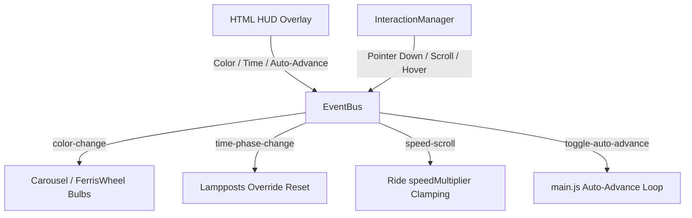

# Interactions System Spec — Luna Park 3D

This specification outlines the centralized interaction system for the Luna Park 3D project. It decouples the input handling, the day/night cycle, and the ride controllers using a custom lightweight EventBus.

---

## 1. Architectural Component Diagram

---

## 2. Component Specifications

### 2.1 EventBus (`js/utils/EventBus.js`)
A lightweight, dependency-free event pub/sub module.
- **Methods**:
  - `on(event, callback)`: Registers listener.
  - `off(event, callback)`: Unregisters listener.
  - `emit(event, data)`: Emits payload to all listeners of `event`.
- **Global / Shared Instance**: Exported as a singleton instance `eventBus`.

### 2.2 InteractionManager (`js/utils/InteractionManager.js`)
Central handler for user input to prevent duplicate raycasts and cursor conflicts.
- **Listeners**:
  - `pointerdown` and `touchstart`: Raycasts to click targets (Control Panels, Lampposts).
  - `pointermove` and `touchmove`: Raycasts to clickable objects. Throttled to a maximum of once every **50ms** using `Date.now()` timestamps. Updates `document.body.style.cursor = 'pointer'` if hover hits, else `'default'`.
  - `wheel`: Raycasts to identify if mouse is over a ride structure (Ferris Wheel, Carousel). Emits `speed-scroll` event with the targeted ride identity and direction.
- **Normalization**: Handles translation of raw touch/pointer coordinates to Normalized Device Coordinates (NDC) `[-1, +1]`.

### 2.3 Ride speedMultiplier Controls
- **Bounds**: `speedMultiplier` clamped between `0.2` (minimum visible rotation) and `3.0` (maximum safe rotation).
- **Reset**: If a ride stops completely (`ease === 0`), `speedMultiplier` resets to `1.0`.

### 2.4 Lamppost Override & Transition
- **Properties**:
  - `isManual`: boolean indicating manual control override.
  - `targetOn`: boolean target state of light (on/off).
- **Tweening**: Linear interpolation of PointLight intensity in `Lampposts.js` update loop (`tick`). Transitions over **0.8s**.
- **Day/Night Cycle Hook**: `DayNightCycle.js` detects sunrise/sunset transition. Emits `time-phase-change` to reset `isManual` back to `false` for all lampposts.

---

## 3. Conflict Resolution

- **Cursor Fighting**: Local cursor updates in `FerrisWheel.js` and `Carousel.js` are removed. The `InteractionManager` takes exclusive control of `style.cursor`.
- **Double Toggle**: Remove direct `pointerdown` listeners in ride files. The `InteractionManager` processes control panel clicks and invokes `controller.toggle()`.
